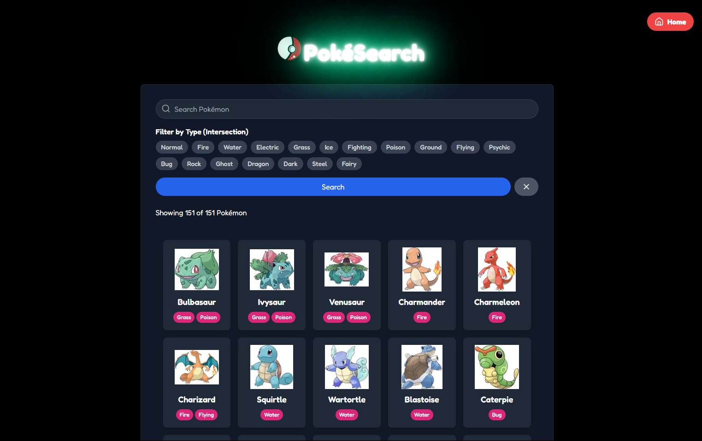
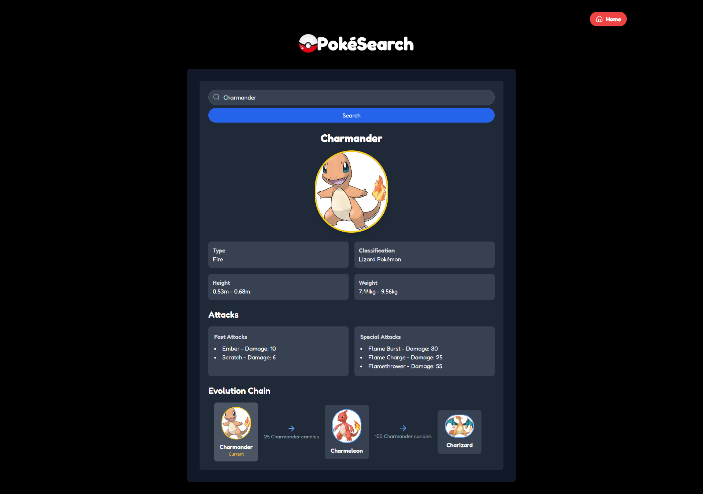

# PokeSearch

This is a [Next.js](https://nextjs.org) project bootstrapped with [`create-next-app`](https://nextjs.org/docs/app/api-reference/cli/create-next-app), designed as a side project to search for Pokémon using a GraphQL API.

## Getting Started

First, run the development server:

```bash
npm run dev
# or
yarn dev
# or
pnpm dev
# or
bun dev
```

Open [http://localhost:3000](http://localhost:3000) with your browser to see the result.

You can start editing the page by modifying `app/page.tsx`. The page auto-updates as you edit the file.

This project uses [`next/font`](https://nextjs.org/docs/app/building-your-application/optimizing/fonts) to automatically optimize and load [Geist](https://vercel.com/font), a new font family for Vercel.

## Project Details

### Required Stacks

- **Framework:** Next.js (TypeScript) 🎨
- **Backend Communication:** GraphQL 🔄
- **Application Name:** `search-pokemon` 🐾

### Application Features

1. **Data Source** 📊
   - The application uses a Pokémon GraphQL API as its data source. You can interact with the API using the [GraphiQL Debugger](https://graphiql.graphql.org/) to build and test queries efficiently.

2. **Pokemon Interface** ⚡
   - The Pokémon interface should include attributes for attacks and evolutions as defined by the schema in the API.

3. **Search Input Component** 🔍
   - A component that searches the Pokémon API by name.
   - Reads the state of a search query parameter from the URL.

4. **Result Component** 📈
   - Displays all relevant information about the searched Pokémon or a "Not Found" view.
   - Includes details on Pokémon attacks and evolutions.
   - Clicking the name of an evolution updates the search query parameter in the URL and displays the result for the evolution.

### Development Goals

- **Developer Focus:**
  - Use Next.js, React, Apollo optimization. ⚛️
  - Utilize caching and static optimization. 🧊
  - Use path parameters and Next.js routing effectively. 🔀
  - Optimize performance with React libraries. 🚀

### Screenshots

#### Home Page 🏠


#### Result Page 🌐


## Testing (Optional) 🧪

In the same application, create a test suite using the included Jest framework.

1. **Test Mocks** 🐾
   - Create test mocks for the following Pokémon:
     - **Bulbasaur** (Grass 🌱)
     - **Charmander** (Fire 🔥)
     - **Squirtle** (Water 🌊)

2. **Test Suite** 📋
   - Write tests that assert each Pokémon's type is correct (e.g., Grass 🌱 for Bulbasaur, Fire 🔥 for Charmander, Water 🌊 for Squirtle).

## Learn More 📚

To learn more about Next.js and its ecosystem, explore the following resources:

- [Next.js Documentation](https://nextjs.org/docs) - Learn about Next.js features and API. 🧑‍💻
- [Learn Next.js](https://nextjs.org/learn) - An interactive Next.js tutorial. 📖
- [Next.js GitHub Repository](https://github.com/vercel/next.js) - Your feedback and contributions are welcome! 🌟

## Deploy on Vercel 🌍

The easiest way to deploy your Next.js app is to use the [Vercel Platform](https://vercel.com/new?utm_medium=default-template&filter=next.js&utm_source=create-next-app&utm_campaign=create-next-app-readme) from the creators of Next.js.

Check out our [Next.js deployment documentation](https://nextjs.org/docs/app/building-your-application/deploying) for more details. 📜

